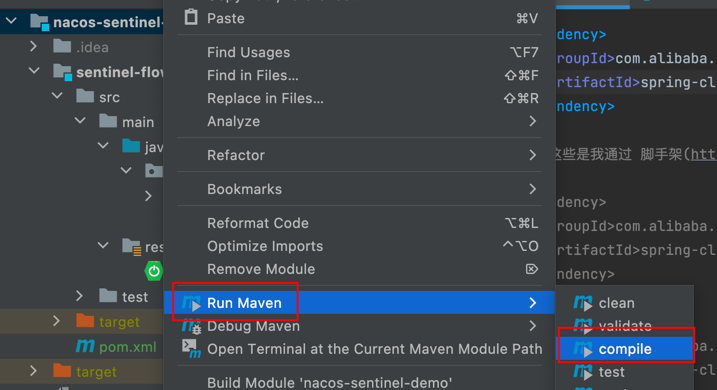

## 1.关于版本选择
关于SpringBoot, Spring Cloud, Spring Cloud Alibaba 三者版本的选择可以参考[官方文档](https://github.com/alibaba/spring-cloud-alibaba/wiki/%E7%89%88%E6%9C%AC%E8%AF%B4%E6%98%8E) 或者使用[脚手架](https://start.aliyun.com/) 来构建项目，这样可以避免版本冲突。

## 2. sentinel 控制台
[参考官方文档说明](https://sentinelguard.io/zh-cn/docs/dashboard.html)

## 3.nacos 2.x 版本客户端说明
首先说一下，如果只是测试sentinel,可以不用连接nacos的，但是我为了全面，还是配置了nacos,但是在连接时报错：【Client not connected,current status:STARTING,StatusRuntimeException】，后确定是因为nacos 2.x 版本后新增了gprc的通信方式，需要新开放2个端口，分别是9848和9849，由于我使用是阿里云服务器，需要去服务中配置即可

## 4.模块说明
1. <b>sentinel-flow</b> : 限流模块测试
2. 
## 5.参考文档
1. [参考文档1](https://developer.aliyun.com/article/878296)

## 6.其他
项目开始只有一个父工程，后面我将父工程的代码结构(src)直接复制到了新的模块[sentinel-flow]中，运行主配置类时报错，找不到主配置类，此时可以重新编译一下
