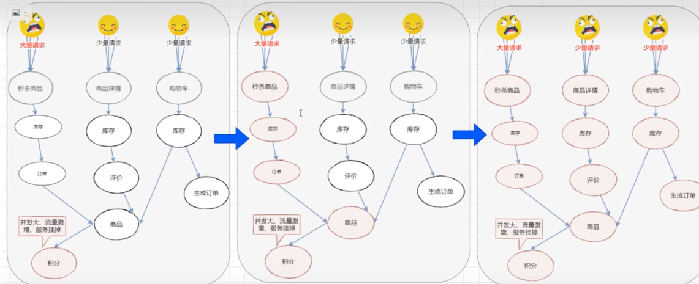
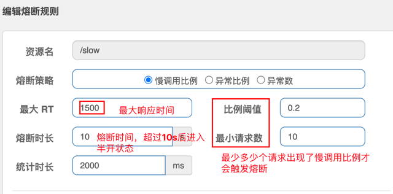
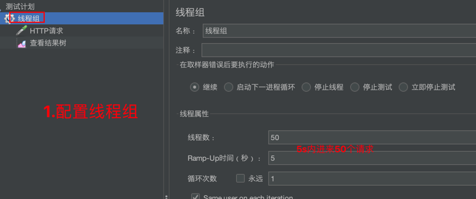
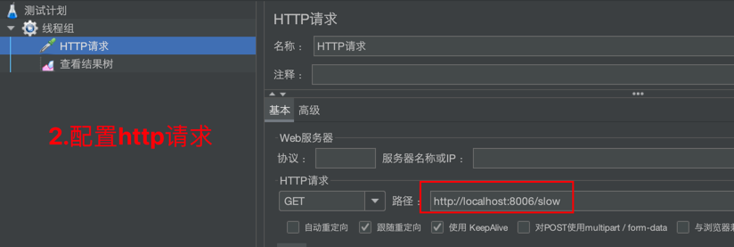
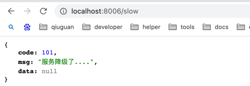
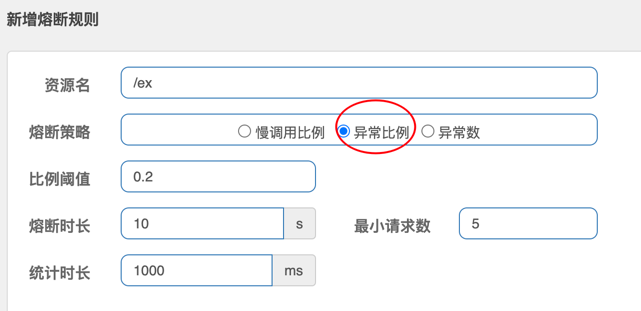
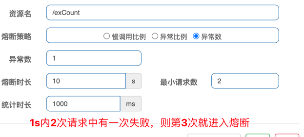
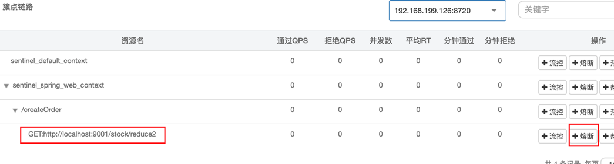
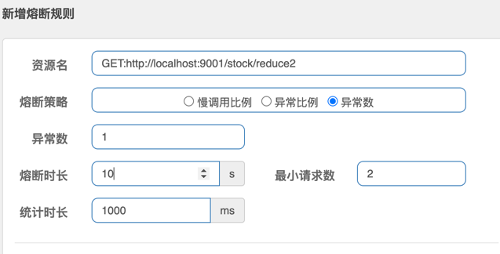

# 1.关于版本选择
关于SpringBoot, Spring Cloud, Spring Cloud Alibaba 三者版本的选择可以参考[官方文档](https://github.com/alibaba/spring-cloud-alibaba/wiki/%E7%89%88%E6%9C%AC%E8%AF%B4%E6%98%8E) 或者使用[脚手架](https://start.aliyun.com/) 来构建项目，这样可以避免版本冲突。

# 2. sentinel 控制台
[参考官方文档说明](https://sentinelguard.io/zh-cn/docs/dashboard.html)

# 3.sentinel 如何使用
[如何使用](https://github.com/alibaba/Sentinel/wiki/%E5%A6%82%E4%BD%95%E4%BD%BF%E7%94%A8)

# 4.nacos 2.x 版本客户端说明
首先说一下，如果只是测试sentinel,可以不用连接nacos的，但是我为了全面，还是配置了nacos,但是在连接时报错：【Client not connected,current status:STARTING,StatusRuntimeException】，后确定是因为nacos 2.x 版本后新增了gprc的通信方式，需要新开放2个端口，分别是9848和9849，由于我使用是阿里云服务器，需要去服务中配置即可


# 5.模块说明
## 5.1 sentinel-flow : 限流模块测试
### 5.1.1 <font color="red">流控模式</font>
#### 5.1.1.1 简单流控模式
1. 请看 `SentinelFlowQPSController` 和 `SentinelFlowThreadController`
> 其中 '阈值类型=线程并发数' 的可以将值配置的小一点，然后开启两个浏览器窗口(无痕)进行测试
2. 请看 /resources/sentinel-img/目录下的图片看下，比较容易理解
#### 5.1.1.2 关联流控模式
1. 请看 `SentinelFlowCorrelationPatternController`
2. 请看 配置细节<br>
> 注意：关联资源那里应该是步骤2
3. 如何测试？需要借助jmeter <br>
  <b><font color="green">i: 定义线程组</font></b> <br>
  <br>
   <b><font color="green">ii: 定义线程组</font></b> <br>
  <br>
   <b><font color="green">iii: 定义线程组</font></b> <br>
  <br>
   <b><font color="green">iiii: 通过浏览器访问订单查询接口</font></b>
  > http://localhost:8085/get 可以看到被限流了。<br>
  

#### 5.1.1.3 链路流控模式
1. 请看 `SentinelFlowLinkPatternController`类，重点看下注释
2. 资源关系网说明：
> 下面记录了资源之间的调用链路，这些资源通过调用关系，相互之间构成一颗调用树，这颗树的根节点是名为getUser的节点，调用链的入口都是他的子节点 <br>
```html
 /order/test1   /order/test2
         \\       //
          \\     //
           \\   //
            \\ //
           getUser
```
3. 资源配置<br>
 <br>
4. 浏览器分别访问 http://localhost:8085/order/test1 和 http://localhost:8085/order/test2, 发现无论访问哪个，规则都不生效，这是为什么？ <br>
> 从1.6.3版本开始，Sentinel Web filter默认收敛所有URL的入口context,因此链路限流不生效。可以通过配置 `spring.cloud.sentinel.web-context-unify=false` 即可关闭收敛

```yaml
spring:
  application:
    name: nacos-sentinel-flow
  cloud:
    nacos:
      discovery:
        #该项目主要是测试sentinel,nacos不是必需的，等后面测试sentinel持久化时才会用到
        server-addr: 47.96.111.179:8848  #nacos 2.x后需要开放出9848和9849两个新端口，不然客户端无法连接服务器，我已经在阿里云服务器开放过了
    sentinel:
      eager: true  #默认是懒加载的,只有访问了一次接口才可以在sentinel控制台上显示
      transport:
        port: 8719 #默认是8719
        #dashboard: http://sentinel.hacketown.com  #sentinel dashboard 的服务器地址和端口
        dashboard: localhost:8080  #确保sentinel控制台和资源访问处于同一个网络中，方便测试我就在本地运行。端口默认是8080，可以在部署时手动指定端口运行
      log:
        dir: /Users/qiuguan/logs/sentinel/
      web-context-unify: false #针对链路模式的设置，默认情况下它将调用链路树收敛了，所以链路限流规则不生效，这里需要打开
```
5. 再次访问后就生效了。访问 /order/test2 就会被限流，而访问 /order/test1 就不会。<br>
6. 关于限流异常的说明
> 由于我定义的"资源"是getUser,而getUser上是标注了 @SentinelResource 注解的，所以此时全局的限流异常就不会生效了，而是使用
> 注解定义的限流异常handler。

7. 问题：我将"链路"修改为"关联"后，发现全局异常生效了，不会走@SientnelResource注解定义的了。。。why ????
* 原来是我弄错了：
   1) 如果资源是 getUser, 关联的资源是 /order/test2, 那么还是走{@link SentinelResource} 注解的异常handler
   2) 如果资源是 /order/test2, 关联的资源是 getUser, 那么走的是全局异常。
* 所以说，到底是走全局异常还是注解定义的异常，就看资源是谁。如果资源在注解上，那么一定走的是注解定义的handler

8. 关联模式和链路模式的区别？ <br>

   | 模式   | 含义                            | 使用场景                                                                                                           |
   ------|-------------------------------|----------------------------------------------------------------------------------------------------------------|
   | 关联模式 | 统计与当前资源相关的另一个资源，触发阀值时，对当前资源限流 | 比如用户支付时需要修改订单状态，同时用户要查询订单。查询和修改操作会争抢数据库锁，产生竞争。业务需求是有限支付和更新订单的业务，因此当修改订单业务触发國值时，需要对查询订单业务限流。                    |
   | 链路模式    | 只针对从指定链路访问到本资源的请求做统计，判断是否超过阈值 | 列如有两条请求链路：<br>/order/test1---→getUser<br>/order/test2---→getUser<br>如果只希望统计从/order/test2进入到getUser的请求，则可以这样按我上面的配置

### 5.1.2 <font color="red">流控效果</font>
#### 5.1.2.1 快速失败
[<b>直接拒绝<b>（RuleConstant.CONTROL_BEHAVIOR_DEFAULT）方式是默认的流量控制方式，当QPS超过任意规则的阈值后，新的请求就会被立即拒绝，拒绝方式为抛出FlowException。这种方式适用于对系统处理能力确切已知的情况下，比如通过压测确定了系统的准确水位时](https://github.com/alibaba/Sentinel/wiki/%E6%B5%81%E9%87%8F%E6%8E%A7%E5%88%B6#%E7%9B%B4%E6%8E%A5%E6%8B%92%E7%BB%9D)
> 前面测试流控模式时，默认的流控效果就是快速失败。

#### 5.1.2.2 Warm Up
[Warm Up（RuleConstant.CONTROL_BEHAVIOR_WARM_UP）方式，即预热/冷启动方式。当系统长期处于低水位的情况下，当流量突然增加时，直接把系统拉升到高水位可能瞬间把系统压垮。通过"冷启动"，让通过的流量缓慢增加，在一定时间内逐渐增加到阈值上限，给冷系统一个预热的时间，避免冷系统被压垮](https://github.com/alibaba/Sentinel/wiki/%E6%B5%81%E9%87%8F%E6%8E%A7%E5%88%B6#warm-up)
* [参考官网](https://github.com/alibaba/Sentinel/wiki/%E6%B5%81%E9%87%8F%E6%8E%A7%E5%88%B6)
> 比如某些商品平时购买量很少，但是大促活动开始，购买量激增，要避免这种瞬时流量把系统打垮


 `冷加载因子，codeFactor = 3, 即请求QPS从 threshold/3开始，经过预热时长逐渐升至设定的QPS阈值`

1. 请看 `WarmUpController` 类
2. sentinel配置预热参数 <br>

> 效果应该是从 15 / 3 = 5 开始在5s内达到阈值

3. 效果演示，浏览器不明显，还是用jmeter测试 <br>
    1) 定义线程组 <br>
   
    2) 定义http请求 <br>
   
    3) 观察sentinel控制台的实时监控
    <br>
   


#### 5.1.2.3 匀速排队
匀速排队（RuleConstant.CONTROL_BEHAVIOR_RATE_LIMITER）方式会严格控制请求通过的间隔时间，也即是让请求以均匀的速度通过，对应的是漏桶算法。[参考官方](https://github.com/alibaba/Sentinel/wiki/%E6%B5%81%E9%87%8F%E6%8E%A7%E5%88%B6#%E5%8C%80%E9%80%9F%E6%8E%92%E9%98%9F)

* WarmUp： 激增流量
* 匀速排队：脉冲流量

1. 请看 `QueueUpController`
2. 体验脉冲流量
   1) 借助jmeter <br>
   <br>
    <br>
    <br>
   
   2) sentinel实时监控大盘 <br>
    <br>
    <br>

> 就是一会有流量，一会又空闲，一会又有流量

针对这种情况，如果我们使用快速失败来看下效果，还是以 `QueueUpController` 为例，我们在sentinel控制台配置QPS=5, 然后流控效果是快速失败，使用上面的jmeter配置进行测试：<br>
 <br>
很明显就是一部分失败，一部分成功，现在我们用 <b>快速排队</b> 来看下：<br>
 <br>

接下来在使用上面的jmeter配置进行测试: <br>
 <br>

从结果上看，没有失败的线程了，全部都被处理了，这样充分利用了服务器的空闲时间，还减少了瞬时流量对服务器的冲击，简直是一举两得。


## 5.2 sentinel-openfeign : feign的集成测试
[降级规则参考官网](https://github.com/alibaba/Sentinel/wiki/%E7%86%94%E6%96%AD%E9%99%8D%E7%BA%A7) <br>
除了流量控制以外，对链路调用中不稳定的资源进行熔断降级也是保障高可用的重要措施之一。我们需要对不稳定的"弱依赖服务调用"进行熔断降级，暂时切断不稳定调用，避免局部不稳定的因素导致整体的雪崩。熔断降级作为保护自身的手段，通常在客户端（调用端)进行配置。（限流一般都是在服务端（接口的提供端）进行配置)<br>
 <br>
比如，积分系统在整个秒杀系统中是微不足道的，是弱依赖的，它down掉后面可以后续进行补偿，不会影响从商品下单，到支付，到扣库存，到发货的核心流程。
> 核心系统down掉，整个链路就失败好了，比如下单中支付模块失败了，那就直接失败就行了

[熔断降级与隔离]
* 保护转身的手段
  1) 并发控制(信号量隔离)
  2) 基于慢调用比例进行熔断
  3) 基于异常比例进行熔断
> 通常在客户端组合配置

* 触发熔断后的处理逻辑示例
  1) 提供fallback实现（服务降级)
  2) 返回错误result
  3) 读缓存(DB访问降级)

### 5.2.1 熔断策略
[参考官网](https://github.com/alibaba/Sentinel/wiki/%E7%86%94%E6%96%AD%E9%99%8D%E7%BA%A7#%E7%86%94%E6%96%AD%E9%99%8D%E7%BA%A7%E8%A7%84%E5%88%99%E8%AF%B4%E6%98%8E) <br>
* 慢调用比例 (SLOW_REQUEST_RATIO)：选择以慢调用比例作为阈值，需要设置允许的慢调用 RT（即最大的响应时间），请求的响应时间大于该值则统计为慢调用。当单位统计时长（statIntervalMs）内请求数目大于设置的最小请求数目，并且慢调用的比例大于阈值，则接下来的熔断时长内请求会自动被熔断。经过熔断时长后熔断器会进入探测恢复状态（HALF-OPEN 状态），若接下来的一个请求响应时间小于设置的慢调用 RT 则结束熔断，若大于设置的慢调用 RT 则会再次被熔断。
* 异常比例 (ERROR_RATIO)：当单位统计时长（statIntervalMs）内请求数目大于设置的最小请求数目，并且异常的比例大于阈值，则接下来的熔断时长内请求会自动被熔断。经过熔断时长后熔断器会进入探测恢复状态（HALF-OPEN 状态），若接下来的一个请求成功完成（没有错误）则结束熔断，否则会再次被熔断。异常比率的阈值范围是 [0.0, 1.0]，代表 0% - 100%。
* 异常数 (ERROR_COUNT)：当单位统计时长内的异常数目超过阈值之后会自动进行熔断。经过熔断时长后熔断器会进入探测恢复状态（HALF-OPEN 状态），若接下来的一个请求成功完成（没有错误）则结束熔断，否则会再次被熔断。


#### 5.2.1.1 慢调用比例
1. 参考 `SlowCallRatioController`, 接口的响应时间为2s
2. 配置慢调用比例降级规则 <br>
 </br>
> 1.最大RT, 最大响应时间，就是最长时间返回的接口才算慢调用。我这里配置1.5s，我接口的响应时间为2s,所以它本身是慢调用。<br>
> 2.统计时长，比例阈值，最少请求数：就是在统计时长内，最少多少个请求内达到了慢调用比例，才会触发熔断 <br>
> 3.熔断时长：就是触发熔断后，在10s内都是断开的，10s钟后，进入"半开"状态，如果这中间有一个请求进来发现是慢调用，则立即进入熔断状态，不会在看其他参数配置。<br>

3. 根据上面配置的降级规则，我们利用jmeter来测试看下：
 <br>
 <br>

此时jmeter发起测试完毕后，我们通过浏览器再去访问 http://localhost:8006/slow 就会发现，提示"服务降级了"。此时我们可以等待10s在请求，发现请求完一次后，再次请求会立马进入"熔断"。<br>



#### 5.2.1.2 异常比例
1. 请看 `ExceptionRatioController`
2. 配置异常比例参数 <br>

3. 然后简单配置一下jmeter, 调用完成后，浏览器访问发现降级了，然后等10s在访问一次，会异常，然后在访问就继续熔断。

#### 5.2.1.3 异常数
1. 请看 `ExceptionCountController`
2. 配置异常数参数<br>

> 这个相对简单，浏览器快速访问2次，第3次请求会进入熔断，等待10s再次请求，响应失败，然后在请求会立即进入熔断。


### 5.2.2 openfeign集成
1. 集成openfeign
```xml
<dependency>
    <groupId>org.springframework.cloud</groupId>
    <artifactId>spring-cloud-starter-openfeign</artifactId>
    <version>3.1.5</version>
</dependency>

<dependency>
    <groupId>com.alibaba.cloud</groupId>
    <artifactId>spring-cloud-starter-alibaba-sentinel</artifactId>
</dependency>
```
<br>
请看 `com.qiuguan.cloud.sentinel.openfeign` 下面的代码

2. sentinel控制台配置feign的降级
> 以 `Order2FeignClient` 为例进行配置
 <br>
注意：配置的时候要选择 "feign" 标注的请求路径，作为熔断降级的资源，不是我们的Controller入口（createOrder)。

3. 配置规则
 <br>
快速访问两次都失败了，第三次从页面上看到的就是我们指定的降级规则了。


## 5.3 sentinel-gateway : 网关的集成测试
## 5.4 sentinel-nacos-datasource : sentinel配置的持久化


# 6.参考文档
1. [参考文档1](https://developer.aliyun.com/article/878296)

# 7.其他
1. 项目开始只有一个父工程，后面我将父工程的代码结构(src)直接复制到了新的模块[sentinel-flow]中，运行主配置类时报错，找不到主配置类，此时可以重新编译一下 <br>


2. sentinel不显示资源 <br>

请求接口后无法看到实时监控，关闭懒加载后也一样看不到，添加了相关注解也无法看到，原来是因为我的请求资源(Controller)和sentinel控制台不在同一个网络中，sentinel控制台我是部署到了阿里云服务器上，资源是本地的springboot, 只需要将二者部署在同一个网络中即可。

