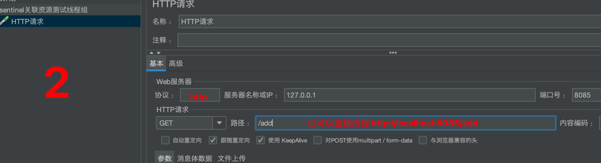

## 1.关于版本选择
关于SpringBoot, Spring Cloud, Spring Cloud Alibaba 三者版本的选择可以参考[官方文档](https://github.com/alibaba/spring-cloud-alibaba/wiki/%E7%89%88%E6%9C%AC%E8%AF%B4%E6%98%8E) 或者使用[脚手架](https://start.aliyun.com/) 来构建项目，这样可以避免版本冲突。

## 2. sentinel 控制台
[参考官方文档说明](https://sentinelguard.io/zh-cn/docs/dashboard.html)

## 3.sentinel 如何使用
[如何使用](https://github.com/alibaba/Sentinel/wiki/%E5%A6%82%E4%BD%95%E4%BD%BF%E7%94%A8)

## 4.nacos 2.x 版本客户端说明
首先说一下，如果只是测试sentinel,可以不用连接nacos的，但是我为了全面，还是配置了nacos,但是在连接时报错：【Client not connected,current status:STARTING,StatusRuntimeException】，后确定是因为nacos 2.x 版本后新增了gprc的通信方式，需要新开放2个端口，分别是9848和9849，由于我使用是阿里云服务器，需要去服务中配置即可

## 5.模块说明
### 5.1 sentinel-flow : 限流模块测试
#### 5.1.1 简单流控模式
1. 请看 `SentinelFlowQPSController` 和 `SentinelFlowThreadController`
> 其中 '阈值类型=线程并发数' 的可以将值配置的小一点，然后开启两个浏览器窗口(无痕)进行测试
2. 请看 /resources/sentinel-img/目录下的图片看下，比较容易理解
#### 5.1.2 关联流控模式
1. 请看 `SentinelFlowCorrelationPatternController`
2. 请看 配置细节
3. 如何测试？需要借助jmeter  
  <b>i: 定义线程组</b>
 
   <b>ii: 定义线程组</b>
 
   <b>iii: 定义线程组</b>
 
   <b>iiii: 通过浏览器访问订单查询接口</b>
  > http://localhost:8085/get 可以看到被限流了。
  

#### 5.1.3 链路流控模式

### 5.2 sentinel-feign : feign的集成测试
### 5.3 sentinel-gateway : 网关的集成测试
### 5.4 sentinel-nacos-datasource : sentinel配置的持久化

## 6.参考文档
1. [参考文档1](https://developer.aliyun.com/article/878296)

## 7.其他
1. 项目开始只有一个父工程，后面我将父工程的代码结构(src)直接复制到了新的模块[sentinel-flow]中，运行主配置类时报错，找不到主配置类，此时可以重新编译一下

2. sentinel不显示资源  
如图
请求接口后无法看到实时监控，关闭懒加载后也一样看不到，添加了相关注解也无法看到，原来是因为我的请求资源(Controller)和sentinel控制台不在同一个网络中，sentinel控制台我是部署到了阿里云服务器上，资源是本地的springboot, 只需要将二者部署在同一个网络中即可。
